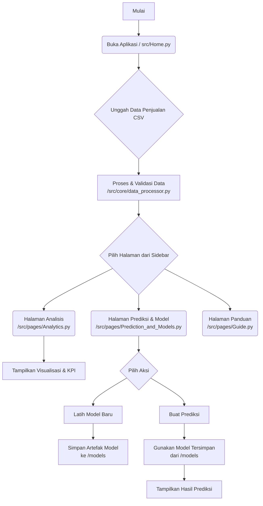

# Aplikasi Prediksi Penjualan UMKM Kuliner

Selamat datang di Aplikasi Prediksi Penjualan UMKM Kuliner. Aplikasi ini adalah sebuah alat bantu berbasis web yang dirancang untuk membantu para pelaku Usaha Mikro, Kecil, dan Menengah (UMKM) di bidang kuliner dalam menganalisis data penjualan dan memprediksi penjualan di masa depan. Dibangun dengan Streamlit dan pustaka analisis data Python, aplikasi ini menyediakan antarmuka yang intuitif untuk mengubah data transaksi mentah menjadi wawasan bisnis yang dapat ditindaklanjuti.

## ✨ Fitur Utama

- **Dua Mode Penggunaan**: 
  - **Mode Normal**: Disederhanakan untuk pengguna non-teknis yang membutuhkan wawasan cepat.
  - **Mode Lanjutan**: Menyediakan alat analisis dan konfigurasi model yang mendalam untuk pengguna mahir.
- **Dukungan Multi-Bahasa**: Antarmuka tersedia dalam Bahasa Indonesia dan Inggris.
- **Dasbor Analitik Interaktif**: Visualisasikan tren penjualan, performa produk, dan metrik utama (KPI) dengan filter dinamis.
- **Analisis Data Lanjutan**: Termasuk heatmap korelasi untuk melihat hubungan antar variabel dan deteksi outlier untuk mengidentifikasi anomali data.
- **Machine Learning Terintegrasi**: Latih model prediksi (Random Forest, XGBoost, LightGBM, atau gabungan) langsung dari aplikasi.
- **Optimasi Model**: Fitur canggih untuk optimasi hyperparameter, seleksi fitur, dan penanganan outlier secara otomatis.
- **Sistem Prediksi Fleksibel**: Buat prediksi untuk satu produk atau prediksi massal untuk semua produk dalam rentang waktu tertentu.

---

## 📊 Diagram Alur Aplikasi

Diagram berikut mengilustrasikan alur kerja utama dalam aplikasi, dari pengunggahan data hingga mendapatkan hasil prediksi.



---

## ⚙️ Struktur Proyek

Proyek ini diorganisir dengan struktur yang bersih dan modular untuk kemudahan pemeliharaan dan pengembangan.

```text
c:/Skripsi_Prediksi_Penjualan/
├── models/                   # Direktori untuk menyimpan model terlatih (.pkl)
├── src/                      # Direktori utama kode sumber
│   ├── core/                 # Logika inti aplikasi
│   │   ├── __init__.py
│   │   └── data_processor.py # Modul untuk pembersihan dan transformasi data
│   ├── pages/                # Skrip untuk setiap halaman di aplikasi Streamlit
│   │   ├── Analytics.py
│   │   ├── Guide.py
│   │   └── Prediction_and_Models.py
│   ├── ui/                   # Komponen antarmuka pengguna
│   │   └── styles.py         # CSS dan styling kustom untuk UI
│   └── Home.py               # Skrip utama dan halaman entry point aplikasi
├── tests/                    # Direktori untuk pengujian unit
│   ├── core/
│   │   ├── __init__.py
│   │   └── test_data_processor.py
│   └── __init__.py
├── .gitignore                # File untuk mengabaikan file/folder tertentu
├── README.md                 # Dokumentasi utama proyek (file ini)
├── requirements.txt          # Daftar pustaka Python yang dibutuhkan
└── run_tests.py              # Skrip untuk menjalankan pengujian unit
```

---

## 🚀 Cara Menjalankan Aplikasi

Ikuti langkah-langkah berikut untuk menjalankan aplikasi di lingkungan lokal Anda.

### 1. Prasyarat

- Python 3.9+ terinstal.
- `pip` (package installer for Python).

### 2. Instalasi

Clone repositori ini dan navigasikan ke direktori proyek:

```bash
# (Direkomendasikan) Clone repositori jika Anda menggunakan Git
git clone <url-repositori-anda>
cd Skripsi_Prediksi_Penjualan

# Instal semua pustaka yang diperlukan
pip install -r requirements.txt
```

### 3. Menjalankan Aplikasi

Untuk memulai server Streamlit, jalankan perintah berikut dari direktori root proyek:

```bash
streamlit run src/Home.py
```

Aplikasi akan terbuka secara otomatis di browser web Anda.

### 4. Menjalankan Pengujian

Untuk memastikan semua fungsi inti bekerja dengan benar, jalankan skrip pengujian:

```bash
python run_tests.py
```

---

## 🧠 Logika Aplikasi

1.  **Pemrosesan Data (`/src/core/data_processor.py`)**
    - Saat pengguna mengunggah file CSV, fungsi `process_data` dipanggil.
    - Fungsi ini melakukan validasi kolom, membersihkan format mata uang (misalnya, mengubah "Rp10.000" menjadi `10000.0`), dan mengubah kolom `waktu` menjadi objek datetime.
    - Fitur-fitur baru seperti `tahun`, `bulan`, dan `hari_dalam_minggu` diekstrak dari data waktu untuk digunakan dalam analisis dan pemodelan.

2.  **Analisis dan Visualisasi (`/src/pages/Analytics.py`)**
    - Halaman ini mengambil data yang telah diproses dari session state Streamlit.
    - Pengguna dapat memfilter data berdasarkan rentang tanggal, produk, kategori, dan lainnya.
    - Metrik utama (KPI) dihitung secara dinamis berdasarkan data yang difilter.
    - Grafik interaktif (dibuat dengan Plotly) digunakan untuk menampilkan tren penjualan, perbandingan produk, dan analisis lanjutan seperti korelasi dan outlier.

3.  **Pemodelan dan Prediksi (`/src/pages/Prediction_and_Models.py`)**
    - **Rekayasa Fitur**: Sebelum training, data diubah lebih lanjut menggunakan fungsi `create_advanced_features`. Fungsi ini menciptakan fitur-fitur kompleks seperti rata-rata bergerak (rolling averages), fitur lag (penjualan bulan lalu), tren, dan interaksi antar fitur untuk meningkatkan akurasi model.
    - **Training Model**: Pengguna dapat memilih model dan mengonfigurasi proses training. Skrip akan membagi data menjadi set data latih dan uji, melatih model, dan mengevaluasi kinerjanya menggunakan metrik seperti MAE, RMSE, dan R².
    - **Penyimpanan Model**: Model yang telah dilatih beserta scaler dan peta fitur disimpan sebagai file `.pkl` di direktori `/models`.
    - **Inferensi/Prediksi**: Saat pengguna meminta prediksi, aplikasi memuat model dan artefak yang relevan, membuat input data untuk periode masa depan, dan menghasilkan prediksi penjualan. Hasilnya kemudian disajikan kembali kepada pengguna.
