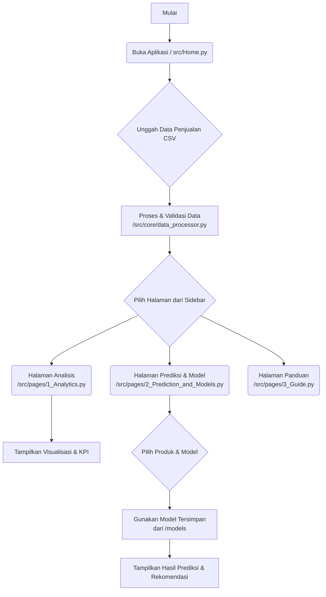

# Aplikasi Prediksi Penjualan UMKM Kuliner

Selamat datang di Aplikasi Prediksi Penjualan UMKM Kuliner. Aplikasi ini adalah sebuah alat bantu berbasis web yang dirancang untuk membantu para pelaku Usaha Mikro, Kecil, dan Menengah (UMKM) di bidang kuliner dalam menganalisis data penjualan dan memprediksi penjualan di masa depan. Dibangun dengan Streamlit, aplikasi ini menyediakan antarmuka yang intuitif untuk mengubah data transaksi mentah menjadi wawasan bisnis yang dapat ditindaklanjuti.

## ✨ Fitur Utama

-   **Dua Mode Penggunaan**:
    -   **Mode Normal**: Disederhanakan untuk pengguna non-teknis yang membutuhkan wawasan cepat.
    -   **Mode Lanjutan**: Menyediakan alat analisis dan konfigurasi model yang mendalam untuk pengguna mahir.
-   **Dukungan Multi-Bahasa**: Antarmuka tersedia dalam Bahasa Indonesia dan Inggris.
-   **Dasbor Analitik Interaktif**: Visualisasikan tren penjualan, performa produk, dan metrik utama (KPI) dengan filter dinamis.
-   **Analisis Data Lanjutan**: Termasuk heatmap korelasi untuk melihat hubungan antar variabel dan deteksi outlier untuk mengidentifikasi anomali data.
-   **Sistem Prediksi Fleksibel**: Buat prediksi untuk satu produk atau prediksi massal untuk semua produk dalam rentang waktu tertentu menggunakan model machine learning yang sudah dilatih sebelumnya.
-   **Rekomendasi Strategis**: Dapatkan saran yang dapat ditindaklanjuti berdasarkan hasil prediksi untuk membantu dalam perencanaan stok dan strategi promosi.

---

## 📊 Diagram Alur Aplikasi

Diagram berikut mengilustrasikan alur kerja utama dalam aplikasi, dari pengunggahan data hingga mendapatkan hasil prediksi.



---

## ⚙️ Struktur Proyek

Proyek ini diorganisir dengan struktur yang bersih dan modular untuk kemudahan pemeliharaan dan pengembangan.

```text
c:/Skripsi_Prediksi_Penjualan/
├── models/                   # Direktori untuk menyimpan model terlatih (.pkl)
├── src/                      # Direktori utama kode sumber aplikasi
│   ├── core/                 # Logika inti aplikasi
│   │   └── data_processor.py # Modul untuk pembersihan dan transformasi data
│   ├── pages/                # Skrip untuk setiap halaman di aplikasi Streamlit
│   │   ├── 1_Analytics.py
│   │   ├── 2_Prediction_and_Models.py
│   │   └── 3_Guide.py
│   ├── ui/                   # Komponen antarmuka pengguna
│   │   └── styles.py         # CSS dan styling kustom untuk UI
│   └── Home.py               # Skrip utama dan halaman entry point aplikasi
├── .gitignore                # File untuk mengabaikan file/folder tertentu
├── README.md                 # Dokumentasi utama proyek (file ini)
├── requirements.txt          # Daftar pustaka Python yang dibutuhkan
└── train_model.py            # Skrip developer untuk melatih ulang model dari awal
```

---

## 🚀 Cara Menjalankan Aplikasi Lokal

Ikuti langkah-langkah berikut untuk menjalankan aplikasi di lingkungan Anda.

### 1. Prasyarat

-   Python 3.9+
-   `pip` (package installer for Python)

### 2. Instalasi

1.  **Clone Repositori** (jika menggunakan Git) atau unduh dan ekstrak kode sumber.
    ```bash
    cd Skripsi_Prediksi_Penjualan
    ```

2.  **(Direkomendasikan) Buat dan Aktifkan Virtual Environment**
    ```bash
    # Windows
    python -m venv venv
    .\venv\Scripts\activate
    ```

3.  **Instal Dependensi**
    Instal semua pustaka yang diperlukan dari file `requirements.txt`.
    ```bash
    pip install -r requirements.txt
    ```

### 3. Menjalankan Aplikasi

Untuk memulai server Streamlit, jalankan perintah berikut dari direktori root proyek:

```bash
streamlit run src/Home.py
```

Aplikasi akan terbuka secara otomatis di browser web Anda.

---

## 🧠 Logika Aplikasi

1.  **Pemrosesan Data (`/src/core/data_processor.py`)**
    -   Saat pengguna mengunggah file CSV, fungsi `process_data` dipanggil.
    -   Fungsi ini melakukan validasi kolom, membersihkan format mata uang (misalnya, mengubah "Rp10.000" menjadi `10000.0`), dan mengubah kolom `waktu` menjadi objek datetime.
    -   Fitur-fitur baru seperti `tahun`, `bulan`, dan lainnya diekstrak dari data waktu untuk digunakan dalam analisis dan pemodelan.

2.  **Analisis dan Visualisasi (`/src/pages/1_Analytics.py`)**
    -   Halaman ini mengambil data yang telah diproses dari session state Streamlit.
    -   Pengguna dapat memfilter data berdasarkan rentang tanggal, produk, kategori, dan lainnya.
    -   Metrik utama (KPI) dihitung secara dinamis berdasarkan data yang difilter.
    -   Grafik interaktif (dibuat dengan Plotly) digunakan untuk menampilkan tren penjualan, perbandingan produk, dan analisis lanjutan.

3.  **Prediksi Menggunakan Model Pre-trained (`/src/pages/2_Prediction_and_Models.py`)**
    -   **Tanpa Pelatihan Ulang**: Aplikasi **tidak** melakukan pelatihan model secara langsung. Sebaliknya, aplikasi ini memuat model machine learning yang sudah ada dan telah dioptimalkan sebelumnya dari direktori `/models`.
    -   **Pemilihan Model**: Pengguna dapat memilih salah satu dari beberapa model yang tersedia (misalnya, `Ensemble`, `XGBoost`, `Random Forest`, `GradientBoost`) untuk membuat prediksi.
    -   **Proses Inferensi**: Saat pengguna meminta prediksi, aplikasi akan:
        1.  Memuat model (`.pkl`) dan artefak prapemrosesan yang relevan.
        2.  Membuat fitur-fitur yang diperlukan untuk data masa depan berdasarkan data historis yang diunggah pengguna.
        3.  Menjalankan prediksi menggunakan model yang dipilih.
        4.  Menyajikan hasil prediksi dalam bentuk tabel, grafik, dan rekomendasi strategis yang mudah dipahami.
    -   **Pelatihan Model (Untuk Developer)**: Proses pelatihan model yang kompleks dan memakan waktu dilakukan secara terpisah menggunakan skrip `train_model.py`. Skrip ini menghasilkan file-file model di direktori `/models` yang kemudian digunakan oleh aplikasi web.