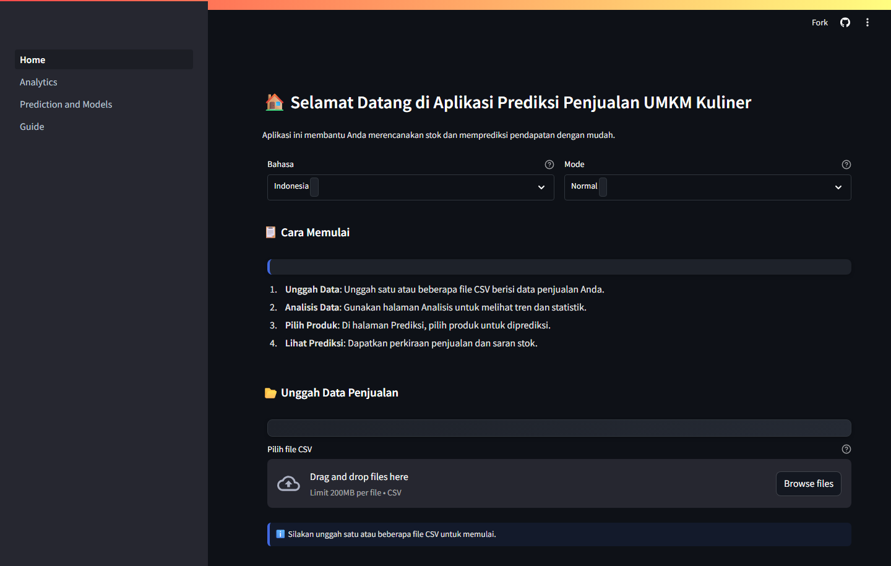
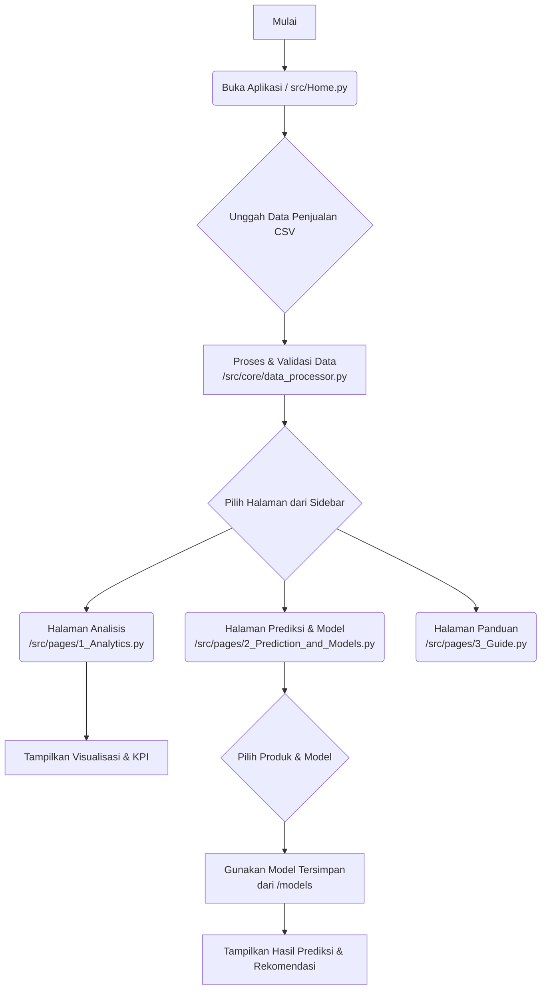

# 🍜 Culinary SME Sales Prediction

A Streamlit web app that turns raw transaction data into sales forecasts and
actionable insights for small food & beverage (F&B) businesses. Built as my
final-year thesis project at Gunadarma University.

**▶ [Live demo](https://app-sales-prediction.streamlit.app/)** &nbsp;·&nbsp; English below &nbsp;·&nbsp; [Versi Bahasa Indonesia](#-versi-bahasa-indonesia)

[](https://app-sales-prediction.streamlit.app/)

<!-- Add a screenshot: save it to docs/screenshot.png and it will render here -->


## Highlights

- **58K+ transaction records** processed and cleaned into model-ready features.
- **5 ML models benchmarked** — Random Forest, XGBoost, LightGBM, Gradient
  Boosting, Logistic Regression — reaching **up to 91% accuracy** after tuning.
- **Interactive analytics dashboard**: sales trends, product performance, KPIs
  with dynamic filters, correlation heatmaps, and outlier detection.
- **Flexible forecasting**: predict a single product or run bulk predictions
  across all products for a chosen period, using pre-trained models.
- **Strategic recommendations** for stock planning and promotions, plus a
  simplified "Normal" mode for non-technical users and an "Advanced" mode for
  deeper analysis. Bilingual UI (Indonesian / English).

## Tech stack

Python · Streamlit · scikit-learn · XGBoost · LightGBM · Plotly · pandas

## Quickstart

```bash
# 1. install
python -m venv venv && .\venv\Scripts\activate      # Windows
pip install -r requirements.txt

# 2. train models (creates the .pkl files in /models)
python train_model.py

# 3. run
streamlit run src/Home.py
```

## Project structure

```text
├── models/                   # trained models (.pkl)
├── src/
│   ├── core/data_processor.py   # data cleaning & feature engineering
│   ├── pages/                   # Streamlit pages (Analytics, Prediction, Guide)
│   ├── ui/styles.py             # custom styling
│   └── Home.py                  # entry point
├── train_model.py            # (developer) retrain models from scratch
└── requirements.txt
```

## How it works

1. **Data processing** (`src/core/data_processor.py`) — validates columns, cleans
   currency formats (e.g. `"Rp10.000"` → `10000.0`), parses timestamps, and
   engineers time features (year, month, …) for analysis and modeling.
2. **Analytics** (`src/pages/1_Analytics.py`) — filterable KPIs and interactive
   Plotly charts over the processed data.
3. **Prediction** (`src/pages/2_Prediction_and_Models.py`) — loads pre-trained,
   pre-optimized models from `/models` (no live retraining) and runs inference,
   returning tables, charts, and plain-language recommendations. The heavy
   training runs separately in `train_model.py`.

---

# 🇮🇩 Versi Bahasa Indonesia

# Aplikasi Prediksi Penjualan UMKM Kuliner

Selamat datang di Aplikasi Prediksi Penjualan UMKM Kuliner. Aplikasi ini adalah sebuah alat bantu berbasis web yang dirancang untuk membantu para pelaku Usaha Mikro, Kecil, dan Menengah (UMKM) di bidang kuliner dalam menganalisis data penjualan dan memprediksi penjualan di masa depan. Dibangun dengan Streamlit, aplikasi ini menyediakan antarmuka yang intuitif untuk mengubah data transaksi mentah menjadi wawasan bisnis yang dapat ditindaklanjuti.

## ✨ Fitur Utama

-   **Dua Mode Penggunaan**:
    -   **Mode Normal**: Disederhanakan untuk pengguna non-teknis yang membutuhkan wawasan cepat.
    -   **Mode Lanjutan**: Menyediakan alat analisis dan konfigurasi model yang mendalam untuk pengguna mahir.
-   **Dukungan Multi-Bahasa**: Antarmuka tersedia dalam Bahasa Indonesia dan Inggris.
-   **Dasbor Analitik Interaktif**: Visualisasikan tren penjualan, performa produk, dan metrik utama (KPI) dengan filter dinamis.
-   **Analisis Data Lanjutan**: Termasuk heatmap korelasi untuk melihat hubungan antar variabel dan deteksi outlier untuk mengidentifikasi anomali data.
-   **Sistem Prediksi Fleksibel**: Buat prediksi untuk satu produk atau prediksi massal untuk semua produk dalam rentang waktu tertentu menggunakan model machine learning yang sudah dilatih sebelumnya.
-   **Rekomendasi Strategis**: Dapatkan saran yang dapat ditindaklanjuti berdasarkan hasil prediksi untuk membantu dalam perencanaan stok dan strategi promosi.

## 📊 Diagram Alur Aplikasi


```mermaid
graph TD
    A[Mulai] --> B(Buka Aplikasi / src/Home.py);
    B --> C{Unggah Data Penjualan CSV};
    C --> D[Proses & Validasi Data<br>/src/core/data_processor.py];
    D --> E{Pilih Halaman dari Sidebar};
    E --> F(Halaman Analisis<br>/src/pages/1_Analytics.py);
    E --> G(Halaman Prediksi & Model<br>/src/pages/2_Prediction_and_Models.py);
    E --> H(Halaman Panduan<br>/src/pages/3_Guide.py);
    F --> I[Tampilkan Visualisasi & KPI];
    G --> J{Pilih Produk & Model};
    J --> K[Gunakan Model Tersimpan<br>dari /models];
    K --> L[Tampilkan Hasil Prediksi & Rekomendasi];
```

## ⚙️ Struktur Proyek

```text
├── models/                   # Direktori untuk menyimpan model terlatih (.pkl)
├── src/                      # Direktori utama kode sumber aplikasi
│   ├── core/                 # Logika inti aplikasi
│   │   └── data_processor.py # Modul untuk pembersihan dan transformasi data
│   ├── pages/                # Skrip untuk setiap halaman di aplikasi Streamlit
│   │   ├── 1_Analytics.py
│   │   ├── 2_Prediction_and_Models.py
│   │   └── 3_Guide.py
│   ├── ui/                   # Komponen antarmuka pengguna
│   │   └── styles.py         # CSS dan styling kustom untuk UI
│   └── Home.py               # Skrip utama dan halaman entry point aplikasi
├── .gitignore
├── README.md
├── requirements.txt          # Daftar pustaka Python yang dibutuhkan
└── train_model.py            # Skrip developer untuk melatih ulang model dari awal
```

## 🚀 Cara Menjalankan Aplikasi Lokal

### 1. Prasyarat
-   Python 3.9+
-   `pip`

### 2. Instalasi
```bash
# (Direkomendasikan) Buat dan Aktifkan Virtual Environment
python -m venv venv
.\venv\Scripts\activate

# Instal Dependensi
pip install -r requirements.txt
```

### 3. Menjalankan Aplikasi

**a. Latih Model (Langkah Penting)** — membuat file model (`.pkl`) di folder `/models`:
```bash
python train_model.py
```
*Catatan: skrip ini menggunakan data sampel untuk menghasilkan model. Ganti file CSV-nya jika ingin memakai data sendiri.*

**b. Jalankan Aplikasi Streamlit**:
```bash
streamlit run src/Home.py
```

## 🧠 Logika Aplikasi

1.  **Pemrosesan Data (`/src/core/data_processor.py`)** — validasi kolom, membersihkan format mata uang (misalnya "Rp10.000" → `10000.0`), mengubah kolom `waktu` menjadi datetime, dan mengekstrak fitur `tahun`, `bulan`, dll.
2.  **Analisis dan Visualisasi (`/src/pages/1_Analytics.py`)** — data yang diproses difilter berdasarkan tanggal/produk/kategori; KPI dihitung dinamis; grafik interaktif dengan Plotly.
3.  **Prediksi Menggunakan Model Pre-trained (`/src/pages/2_Prediction_and_Models.py`)** — aplikasi memuat model yang sudah dioptimalkan dari `/models` (tanpa pelatihan ulang), menjalankan inferensi, dan menyajikan hasil dalam tabel, grafik, serta rekomendasi strategis. Pelatihan yang berat dilakukan terpisah lewat `train_model.py`.
